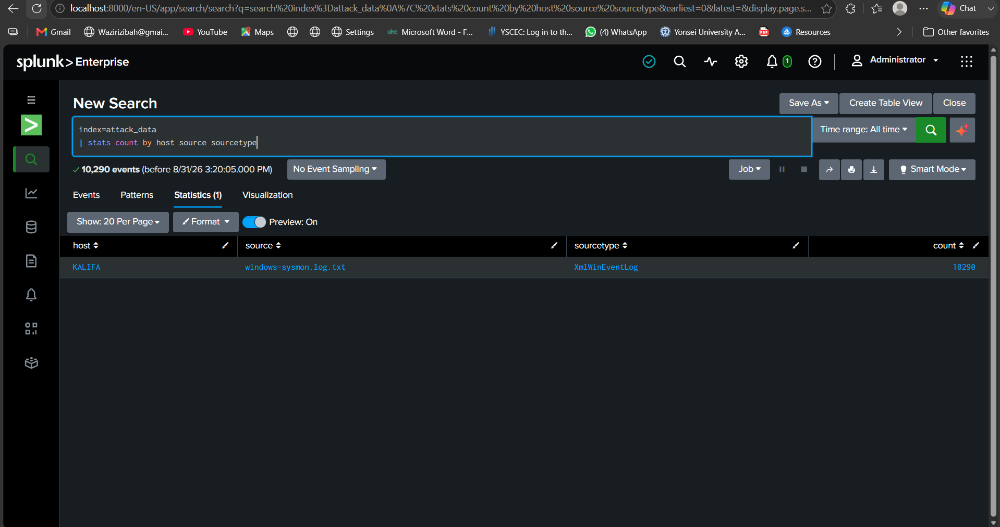
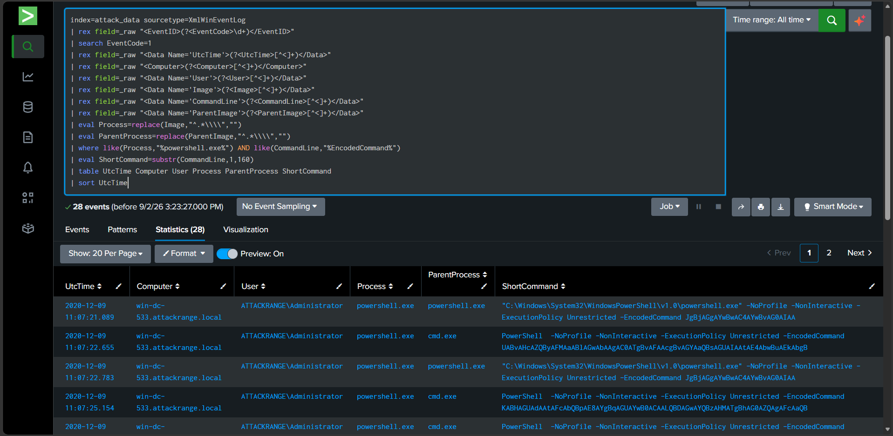
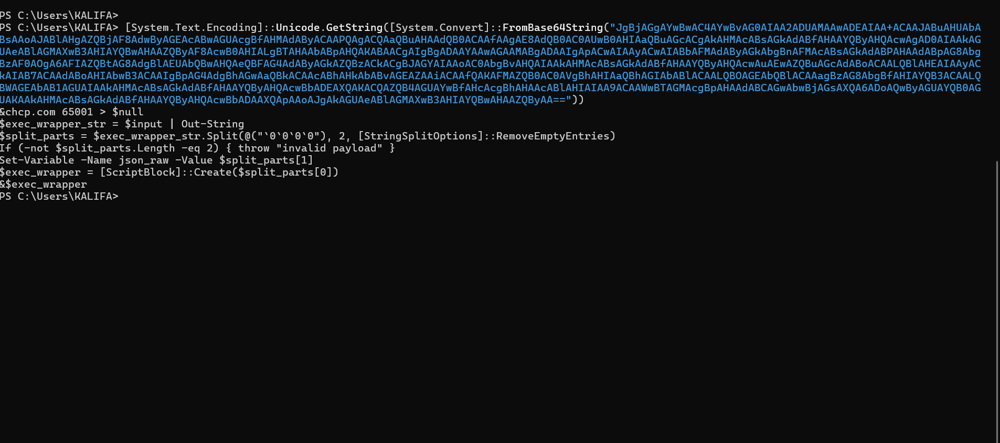
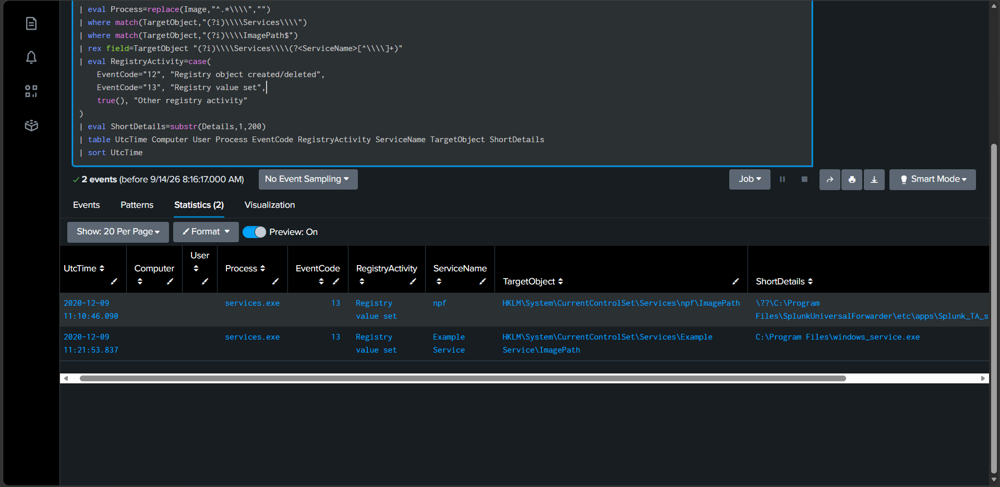
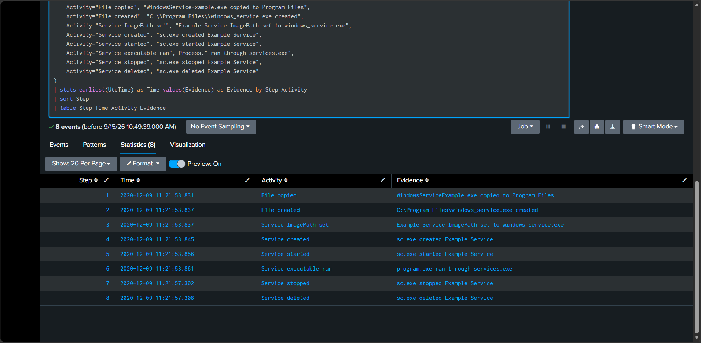
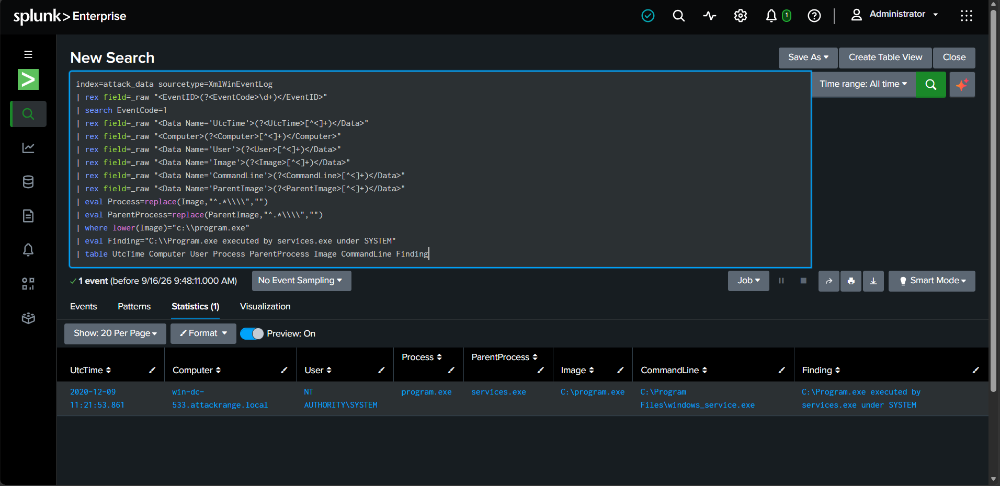
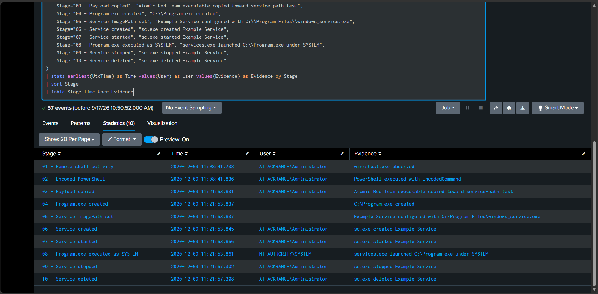
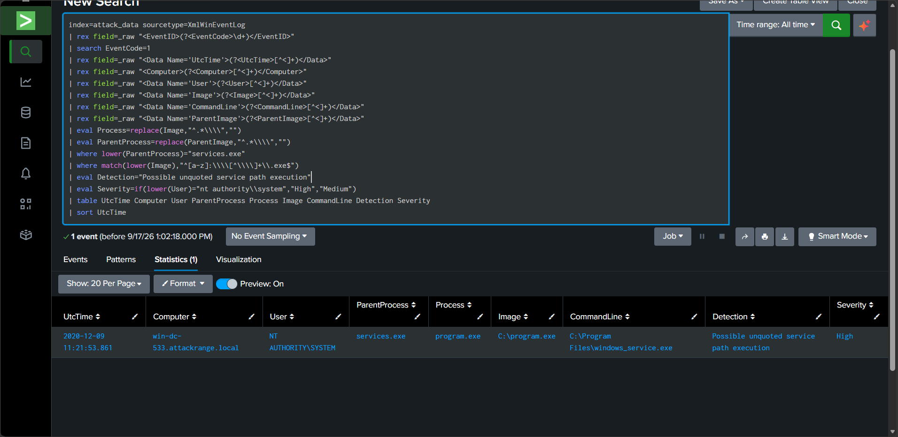

# Windows Sysmon Threat Investigation & Detection Engineering in Splunk

**Analyst:** Kalifa  
**Platform:** Splunk Enterprise  
**Data Source:** Windows Sysmon XML Event Logs  
**Dataset:** Splunk Attack Data – First Time Windows Service  
**Investigation Date:** September 2026  
**Observed Event Date:** 9 December 2020  

---

## 1. Project Overview

This project documents a structured Security Operations Center (SOC) investigation using a public Windows attack-simulation dataset in Splunk.

The investigation began with a broad review of imported Sysmon telemetry and progressively narrowed into suspicious PowerShell activity, Windows service creation, registry changes, file creation, and SYSTEM-level process execution.

The most significant finding was a simulated **unquoted service-path / path-interception scenario**. A Windows service was configured with the unquoted path:

`C:\Program Files\windows_service.exe`

The investigation later confirmed that Windows executed:

`C:\Program.exe`

through `services.exe` under the `NT AUTHORITY\SYSTEM` account.

The dataset also contained explicit Atomic Red Team references to `T1574.009`, supporting the assessment that the activity represents controlled attack-simulation behavior rather than confirmed real-world malware.

---

## 2. Investigation Objectives

The objectives of this investigation were to:

- validate successful ingestion of the attack dataset into Splunk;
- identify suspicious Windows process activity;
- investigate repeated PowerShell `EncodedCommand` execution;
- reconstruct relevant parent-child process relationships;
- investigate Windows service creation and registry modifications;
- determine how `C:\Program.exe` was created and executed;
- reconstruct a consolidated activity timeline;
- map observed behaviors to MITRE ATT&CK;
- develop a reusable Splunk detection for similar service-path behavior.

---

## 3. Dataset and Environment

The Sysmon dataset was imported into the Splunk index:

`attack_data`

with sourcetype:

`XmlWinEventLog`

The initial validation returned **10,290 events**.

The Splunk upload host was `KALIFA`, while the Windows system represented inside the attack logs was:

`win-dc-533.attackrange.local`



**Figure 1:** Confirmation of successful Sysmon attack-data ingestion into Splunk.

The investigation focused primarily on Sysmon process creation, file creation, registry modification, and process access events.

---

## 4. Investigation Methodology

The investigation followed a SOC-style workflow:

1. Confirm data ingestion and identify available Sysmon Event IDs.
2. Review process creation activity.
3. Classify common and suspicious process behavior.
4. Isolate PowerShell executions using `EncodedCommand`.
5. Extract and decode relevant encoded content.
6. Review repeated execution patterns and process relationships.
7. Build a process activity timeline.
8. Investigate Windows service registry activity.
9. Trace suspicious service executable creation and execution.
10. Confirm SYSTEM-level execution.
11. Reconstruct the final activity timeline.
12. Map evidence to MITRE ATT&CK.
13. Convert the investigation finding into a reusable Splunk detection.

The investigation used the principle:

> **Evidence → Interpretation → Confidence → Recommendation**

Suspicious behavior was not automatically treated as malicious. Conclusions were based on correlated evidence from multiple Sysmon event types.

---

## 5. Key Investigation Findings

### 5.1 Suspicious Encoded PowerShell Activity

Process-creation analysis identified repeated PowerShell execution using the `EncodedCommand` parameter.

A total of **28 encoded PowerShell events** were identified for:

`ATTACKRANGE\Administrator`

on:

`win-dc-533.attackrange.local`

The activity involved parent-child relationships including:

- `cmd.exe -> powershell.exe`
- `powershell.exe -> powershell.exe`



**Figure 2:** Repeated PowerShell processes executing with the `EncodedCommand` parameter.

Repeated encoded execution is security-relevant because it may reduce the readability of commands during routine monitoring. However, encoded PowerShell alone is not sufficient evidence of malicious intent.

---

### 5.2 Encoded Command Decoding

The investigation extracted encoded command content and decoded selected PowerShell payloads.

One short Base64 value decoded to:

`whoami`

A longer decoded PowerShell payload contained wrapper logic that:

- changed the console code page to UTF-8;
- read input into a string;
- split the payload into multiple sections;
- stored JSON-related data;
- dynamically created a PowerShell `ScriptBlock`;
- executed that script block.



**Figure 3:** Decoded PowerShell wrapper recovered during investigation of the encoded commands.

The wrapper behavior was notable because dynamic script execution can be security-relevant. At this stage, however, the activity was still treated as suspicious rather than automatically classified as malicious.

---

### 5.3 Windows Service Registry Investigation

The investigation later examined registry activity under the Windows Services registry path.

A broad search initially returned a large number of service-related events, so the search was narrowed to service `ImagePath` modifications.

Two relevant `ImagePath` entries were identified:

- `npf`, associated with the Splunk Universal Forwarder environment;
- `Example Service`, configured to execute:

`C:\Program Files\windows_service.exe`



**Figure 4:** Registry ImagePath changes identifying `Example Service` and its executable path.

The `npf` entry was not central to the suspicious service-path sequence and was treated as low priority for this investigation.

`Example Service` was more significant because its executable path contained a space and was configured without quotation marks.

---

### 5.4 Service Creation and Execution Sequence

Further investigation correlated the suspicious service configuration with file and process activity.

The following sequence was observed:

1. `WindowsServiceExample.exe` was copied toward the service-path test.
2. `C:\Program Files\windows_service.exe` was created.
3. The `Example Service` ImagePath was configured.
4. `sc.exe` created `Example Service`.
5. `sc.exe` started the service.
6. A process executed through `services.exe`.
7. The service was stopped.
8. The service was deleted.



**Figure 5:** Reconstructed lifecycle of `Example Service`, including file creation, service creation, execution, and cleanup.

The underlying command data also referenced:

`C:\AtomicRedTeam\atomics\T1574.009\bin\WindowsServiceExample.exe`

This was a major contextual indicator that the dataset represented Atomic Red Team attack simulation.

---

### 5.5 SYSTEM-Level Execution of `C:\Program.exe`

A focused process-creation search identified the strongest execution evidence in the investigation.

Sysmon recorded:

- **Process:** `program.exe`
- **Image:** `C:\Program.exe`
- **Parent process:** `services.exe`
- **User:** `NT AUTHORITY\SYSTEM`
- **Command line:** `C:\Program Files\windows_service.exe`



**Figure 6:** Sysmon evidence showing `C:\Program.exe` executed by `services.exe` under `NT AUTHORITY\SYSTEM`.

The difference between the actual process image and the command line was significant.

The service referenced:

`C:\Program Files\windows_service.exe`

but the process Windows actually launched was:

`C:\Program.exe`

This behavior is consistent with path interception involving an unquoted executable path containing spaces.

---

### 5.6 Origin of `C:\Program.exe`

The investigation then traced how `C:\Program.exe` appeared on the host.

The logs showed:

- a command referencing the Atomic Red Team `WindowsServiceExample.exe`;
- creation of `C:\Program.exe`;
- creation and startup of `Example Service`;
- process-access activity involving `C:\Program.exe`;
- execution of `C:\Program.exe` under SYSTEM;
- subsequent service stop and deletion activity.

This closed an important evidence gap. The investigation did not merely observe `C:\Program.exe` executing; it also established its creation immediately before the service execution sequence.

---

## 6. Consolidated Activity Timeline

The final timeline consolidated the strongest findings from the earlier investigation stages.



**Figure 7:** Consolidated activity timeline from remote shell activity through SYSTEM-level service execution and cleanup.

| Stage | Observed Activity |
|---|---|
| 1 | Remote shell activity through `winrshost.exe` |
| 2 | PowerShell execution using `EncodedCommand` |
| 3 | Atomic Red Team executable copied |
| 4 | `C:\Program.exe` created |
| 5 | `Example Service` ImagePath configured |
| 6 | `Example Service` created |
| 7 | `Example Service` started |
| 8 | `C:\Program.exe` executed by `services.exe` under SYSTEM |
| 9 | `Example Service` stopped |
| 10 | `Example Service` deleted |

The earlier remote-shell and encoded-PowerShell activity occurred on the same system and account context before the later service-path activity. The timeline therefore presents them as related observed activity. It does **not** claim that every earlier event directly caused every later event unless supported by the available logs.

---

## 7. MITRE ATT&CK Mapping

The following ATT&CK techniques are supported by the observed evidence.

| Observed Behavior | MITRE ATT&CK |
|---|---|
| Unquoted path resulted in `C:\Program.exe` execution | **T1574.009 – Path Interception by Unquoted Path** |
| PowerShell executed with `EncodedCommand` | **T1059.001 – PowerShell** |
| `cmd.exe` used for command execution | **T1059.003 – Windows Command Shell** |
| `sc.exe` created and started a Windows service | **T1543.003 – Windows Service** |
| `whoami.exe` used for account/user discovery | **T1033 – System Owner/User Discovery** |

### Primary Technique

The primary technique is:

**T1574.009 – Path Interception by Unquoted Path**

The evidence supporting this mapping includes:

- an unquoted service path containing a space;
- creation of `C:\Program.exe`;
- service startup;
- execution of `C:\Program.exe` by `services.exe`;
- SYSTEM-level execution;
- explicit Atomic Red Team `T1574.009` references in the dataset.

MITRE describes this behavior as taking advantage of file paths that lack surrounding quotation marks, allowing Windows to resolve and execute an unintended executable from a higher-level directory.

---

## 8. Detection Engineering

After completing the investigation, a reusable Splunk detection was developed.

The rule searches Sysmon process-creation events for executables launched by `services.exe` directly from the root of a drive.

The detection does not hard-code `C:\Program.exe`. Instead, it looks for a broader pattern such as:

- parent process = `services.exe`;
- executable launched directly from a drive root;
- elevated attention when execution occurs as `NT AUTHORITY\SYSTEM`.

In the dataset, the detection returned one high-priority result:

- `services.exe -> C:\Program.exe`
- user: `NT AUTHORITY\SYSTEM`
- command line: `C:\Program Files\windows_service.exe`



**Figure 8:** Splunk detection identifying possible unquoted service-path execution as a high-severity event.

The full SPL is stored separately in:

`splunk_queries/19_unquoted_service_path_detection.spl`

The `Severity` and `Detection` fields shown in the result are analyst-created fields used to make the detection output easier to interpret. They are not native Sysmon fields.

---

## 9. Analyst Assessment

### Evidence

The investigation confirmed:

- repeated encoded PowerShell execution;
- remote shell and command-shell activity;
- creation of `Example Service`;
- an unquoted service executable path;
- Atomic Red Team `T1574.009` references;
- creation of `C:\Program.exe`;
- execution of `C:\Program.exe` by `services.exe`;
- execution under `NT AUTHORITY\SYSTEM`;
- service cleanup shortly afterwards.

### Interpretation

The combined evidence is consistent with a controlled simulation of **Path Interception by Unquoted Path** involving a Windows service.

The strongest technical indicator is the mismatch between:

**Configured/command-line path**

`C:\Program Files\windows_service.exe`

and:

**Actual executable image**

`C:\Program.exe`

with `services.exe` as the parent process and SYSTEM as the execution context.

### Confidence

**High confidence** that the service-path activity represents simulated T1574.009 behavior.

The confidence is based on direct Sysmon process evidence, registry evidence, file creation evidence, service-control commands, and explicit Atomic Red Team references.

The earlier remote-shell and encoded-PowerShell activity is strongly associated with the same investigation context, but the available logs should not be used to claim an unproven causal relationship between every individual event.

---

## 10. Recommendations

For a production Windows environment, recommended defensive actions include:

- ensure executable service paths containing spaces are surrounded by quotation marks;
- audit Windows service `ImagePath` registry values for insecure path configurations;
- restrict write permissions to high-risk locations such as the root of `C:\`;
- monitor new executable creation in drive-root directories;
- alert when `services.exe` launches unusual executables from unexpected locations;
- monitor service creation and modification using `sc.exe`;
- monitor PowerShell `EncodedCommand` activity and correlate it with surrounding process behavior;
- correlate service registry changes, file creation, and process execution rather than relying on a single event;
- use application-control technologies where appropriate to restrict unauthorized executable placement and execution.

---

## 11. Scope and Limitations

This project used a **public attack-simulation dataset** rather than telemetry from a live production incident.

Therefore:

- the findings demonstrate investigation and detection methodology;
- they should not be interpreted as evidence of a real compromise;
- some activity may exist specifically to demonstrate ATT&CK techniques;
- conclusions are limited to the events available in the supplied dataset.

The project intentionally distinguishes between suspicious behavior, confirmed log evidence, and analyst interpretation.

---

## 12. Conclusion

This investigation progressed from broad Sysmon analysis to a focused reconstruction of simulated Windows service-path exploitation.

The project demonstrated the ability to:

- ingest and validate Windows telemetry in Splunk;
- extract fields from raw Sysmon XML;
- analyze parent-child process relationships;
- investigate encoded PowerShell;
- distinguish likely benign activity from security-relevant activity;
- correlate process, file, registry, and service events;
- reconstruct a chronological attack timeline;
- map evidence to MITRE ATT&CK;
- develop a reusable Splunk detection from an investigation finding.

The central finding was the execution of `C:\Program.exe` by `services.exe` under `NT AUTHORITY\SYSTEM` while the associated service referenced the unquoted path `C:\Program Files\windows_service.exe`.

In the context of the Atomic Red Team references present in the dataset, the evidence is consistent with a controlled simulation of **MITRE ATT&CK T1574.009 – Path Interception by Unquoted Path**.

---

## 13. Repository Structure

```text
splunk-public-attack-dataset-investigation/
├── README.md
├── investigation_report.md
├── reports/
│   └── 18_mitre_attack_mapping.md
├── screenshots/
│   ├── 01_attack_data_import_confirmed.png
│   ├── 05_suspicious_powershell_encoded_commands.png
│   ├── 07_decoded_powershell_wrapper_command.png
│   ├── 13b_service_imagepath_registry_changes.png
│   ├── 14_windows_service_exe_investigation_summary.png
│   ├── 15_program_exe_service_execution.png
│   ├── 17_final_attack_timeline.png
│   └── 19_unquoted_service_path_detection.png
├── splunk_queries/
│   └── ...
└── dataset/
    └── ...
```

> The complete `screenshots/` and `splunk_queries/` directories may contain additional investigation artifacts that were intentionally not embedded in this report to avoid repetition.

---

## 14. References

- MITRE ATT&CK – T1574.009, Path Interception by Unquoted Path: https://attack.mitre.org/techniques/T1574/009/
- MITRE ATT&CK – T1543.003, Windows Service: https://attack.mitre.org/techniques/T1543/003/
- MITRE ATT&CK – T1059.001, PowerShell: https://attack.mitre.org/techniques/T1059/001/
- MITRE ATT&CK – T1059.003, Windows Command Shell: https://attack.mitre.org/techniques/T1059/003/
- MITRE ATT&CK – T1033, System Owner/User Discovery: https://attack.mitre.org/techniques/T1033/
- Splunk Attack Data dataset used in this project: https://github.com/splunk/attack_data
